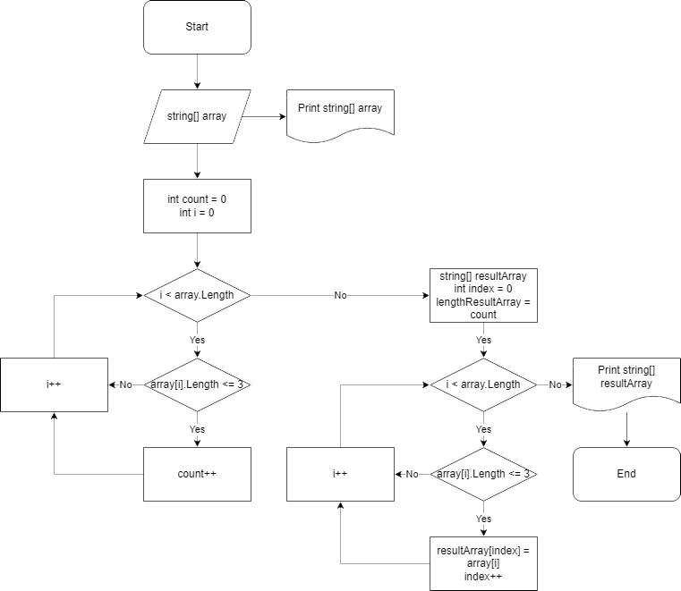

# Итоговая контрольная работа по основному блоку

## Условия задачи

1. Создать репозиторий на GitHub

2. Нарисовать блок-схему алгоритма (можно обойтись блок-схемой основной содержательной части, если вы выделяете её в отдельный метод)

3. Снабдить репозиторий оформленным текстовым описанием решения (файл README.md)

4. Написать программу, решающую поставленную задачу

5. Использовать контроль версий в работе над этим небольшим проектом (не должно быть так, что всё залито одним коммитом, как минимум этапы 2, 3, и 4 должны быть расположены в разных коммитах)

## Задача

Написать программу, которая из имеющегося массива строк формирует новый массив из строк, длина которых меньше, либо равна 3 символам. Первоначальный массив можно ввести с клавиатуры, либо задать на старте выполнения алгоритма. При решении не рекомендуется пользоваться коллекциями, лучше обойтись исключительно массивами.

## Примеры

```
[“Hello”, “2”, “world”, “:-)”] → [“2”, “:-)”]
[“1234”, “1567”, “-2”, “computer science”] → [“-2”]
[“Russia”, “Denmark”, “Kazan”] → []
```

---

## Текстовое описание решения

1. Массив string[] array вводится пользователем при помощи метода CreateArray на старте выполнения алгоритма.

2. Метод PrintArray выводит на экран заданный массив.

3. С помощью метода CountLessThan4StringLength определяется размер нового массива (запускается цикл, который перебирает все элементы заданного массива string[] array и с помощью счетчика count подсчитывает количество элементов, длина которых меньше либо равна 3 символам).

4. Метод NewLessThan4StringArray создает новый массив, с определенным выше размером. Метод на вход принимает заданный в начале алгоритма массив string[] array и размер нового массива lengthResultArray, проходится циклом по этому массиву и элементами с длиной меньше либо равной 3 символам заполняет новый массив string[] resultArray.

5. С помощью повторного обращения к методу PrintArray новый массив string[] resultArray выводится на экран.

---

## Блок-схема алгоритма


